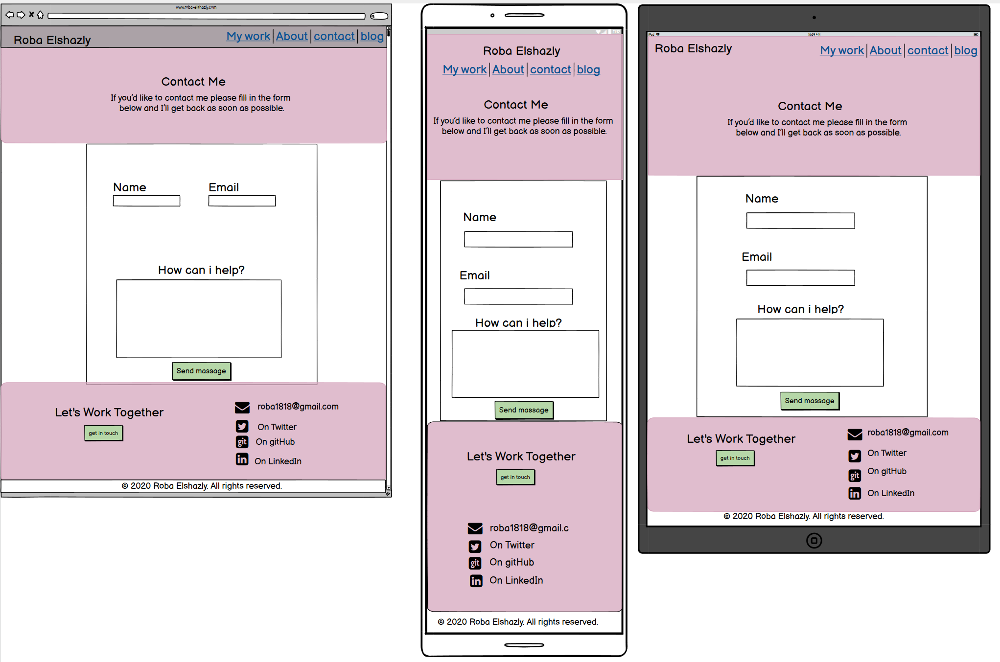

#### For Published website Link [click here](https://roba-elshazly.netlify.app)

#### For GitHub repository Link [click here](https://github.com/robaElshazly/Portfolio)

#### Purpose

I created this portofolio to showcase the Projects that I worked on in the past.

#### Functionality

The home page has the nav bar to anvigate the rest of the website andit also show the projects previously done.

The about page is an introduction about myself .

The blog page has the blogs previously written.

The contact page has a form to fill up your details to contact with me.

Links to twitter, LinkedIn, GitHub, and email address are found in the bottom of each page.

There is also a "get in touch" button in the bottom of every page.

#### Sitemap

___
#### Screenshots

##### Home page wireframe

##### Contact page wireframe

##### Blog page wirframe

___
#### Target audience
 
 prospective employers and fellow developers.
___
#### Tech stack

CSS - HTML

*Note:* all images in this website are sourced from unsplash.com and they are free to use acoording to 
[this](https://help.unsplash.com/en/articles/2612315-can-i-use-unsplash-photos-for-personal-or-commercial-projects#:~:text=The%20photos%20on%20Unsplash%20are,it%20is%20appreciated%20when%20possible.)

